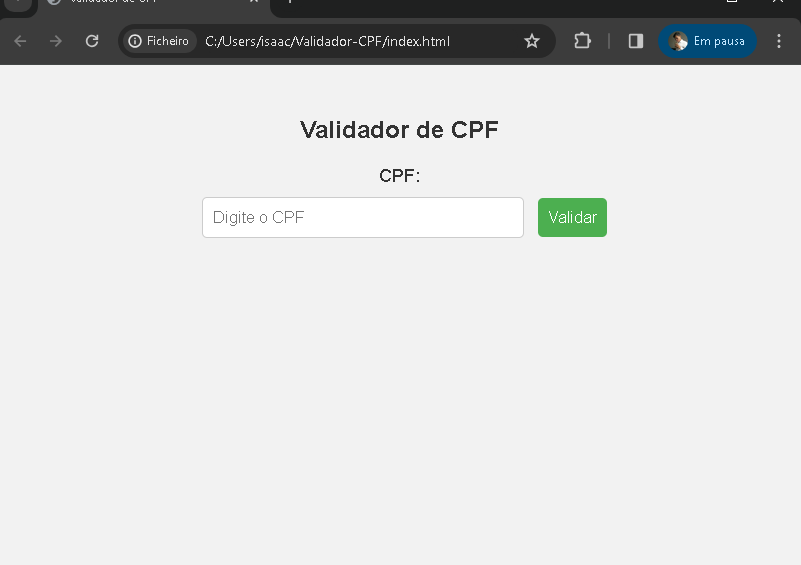

# Validador de CPF



Este projeto consiste em uma aplicação simples que valida números de CPF. A aplicação inclui uma API desenvolvida em Node.js e Express para realizar a validação e um frontend simples em HTML, JavaScript e CSS.

## Funcionalidades

- **Validação de CPF:**
  - A API possui uma única rota `/validar_cpf` que recebe um CPF como parâmetro e retorna um JSON com o resultado da validação.

- **Frontend:**
  - O frontend permite aos usuários inserir um CPF e visualizar o resultado da validação.

## Como Executar o Projeto

1. **Clone o Repositório:**
   ```bash
   git clone https://github.com/seu-usuario/validador-cpf.git
   cd validador-cpf
Instale as Dependências:

Certifique-se de ter o Node.js instalado.
bash
Copy code
npm install
Inicie a API:

bash
Copy code
node app.js
Abra o Frontend:

Abra o arquivo index.html em um navegador ou use uma extensão como "Live Server" no Visual Studio Code.
Estrutura do Projeto
app.js: Arquivo principal da API em Node.js.
index.html: Página HTML do frontend.
app.js: Lógica em JavaScript para fazer a requisição à API.
style.css: Estilo CSS para melhorar a apresentação do frontend.
Observações
Certifique-se de que a API esteja em execução antes de testar o frontend.
O projeto utiliza a biblioteca cpf-check para validar CPFs na API.
